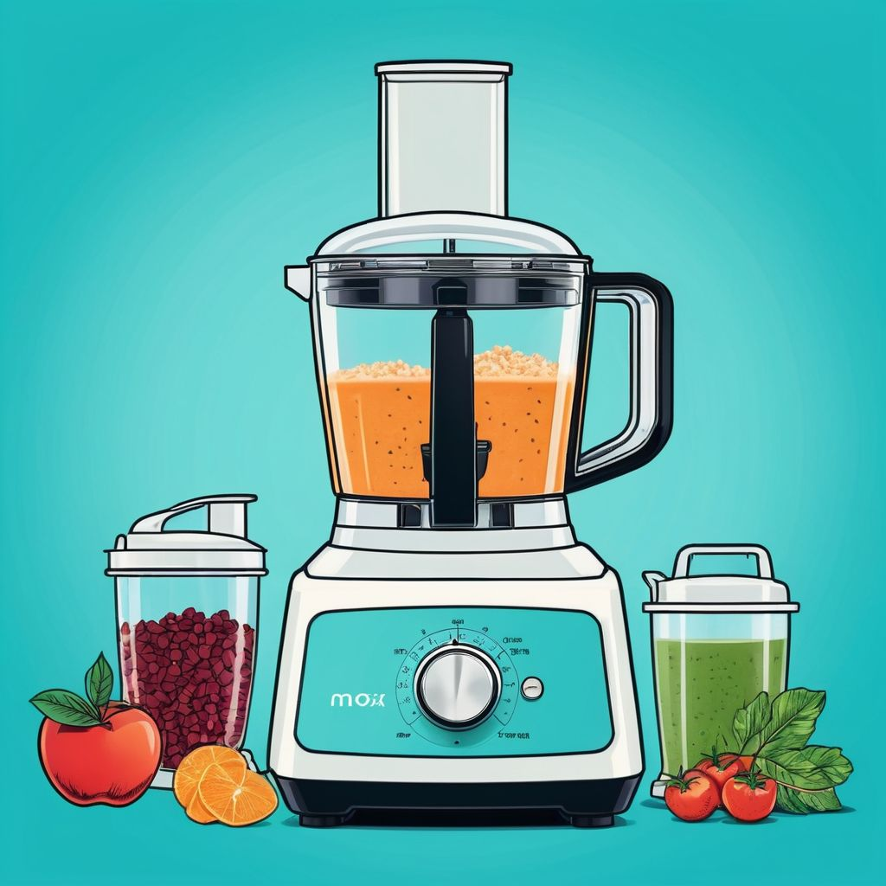

# Antihash

Hash functions are really just turning strings into shorter, more jumbled strings, right? So I made an antihash function, it turns strings into longer, more jumbled strings! Can you guess what my input was?

*Cover image generated with [Img2Go](https://www.img2go.com/), licensed under [CC BY-NC 4.0](https://www.creativecommons.org/licenses/by-nc/4.0/deed.en).*
